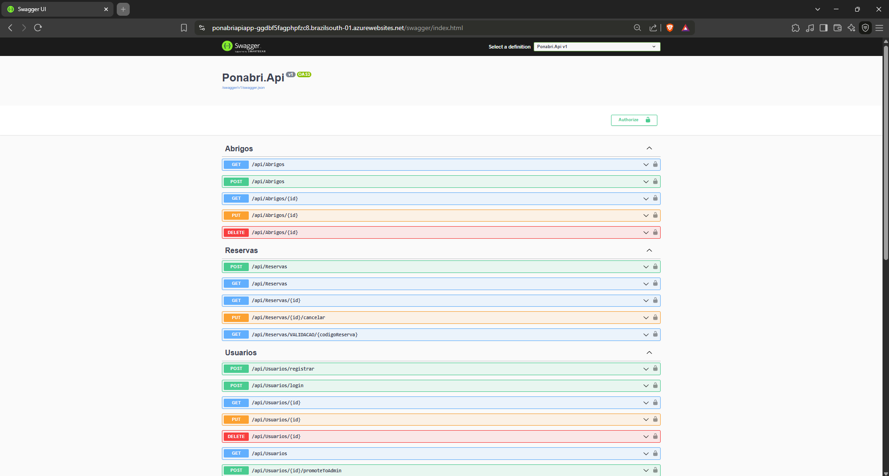
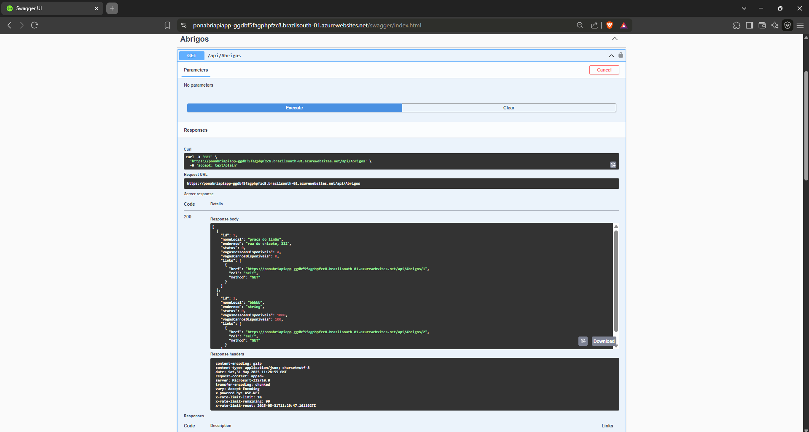
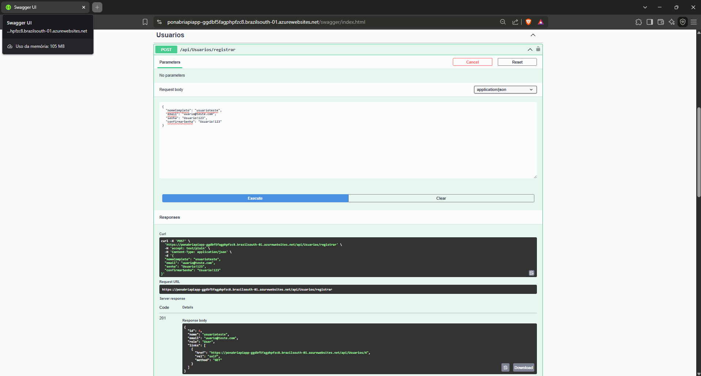
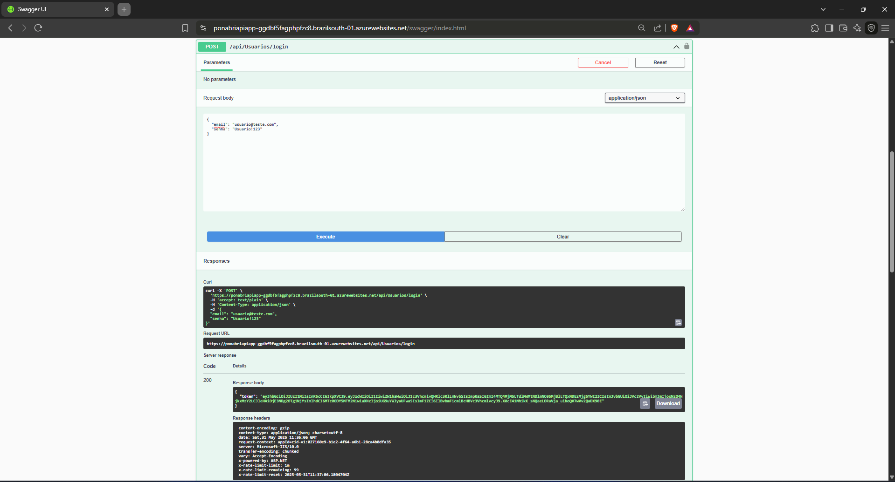
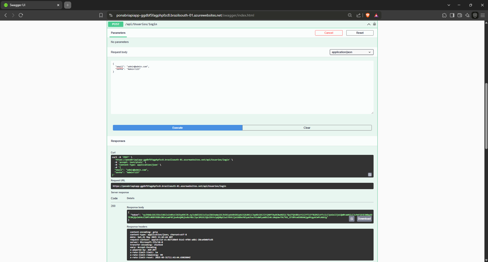
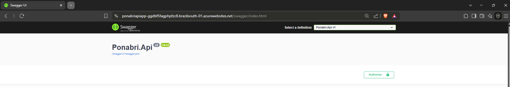
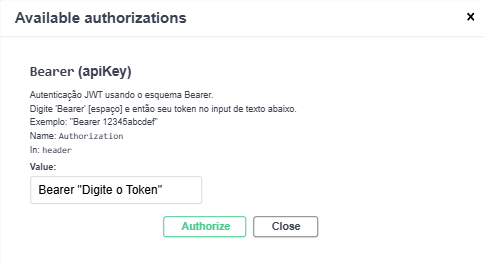

# Ponabri API - Sistema de Gerenciamento de Abrigos e Reservas

---

## Checklist de Requisitos da Disciplina 'Advanced Business Development with .NET'

| Requisito da Disciplina                          | Atendido? | Justificativa / Evidência no Projeto Ponabri API                                                                                      |
|-------------------------------------------------|-----------|--------------------------------------------------------------------------------------------------------------------------------------|
| CRUD de pelo menos 3 entidades                   | Sim       | Implementação dos controllers `UsuariosController`, `AbrigosController` e `ReservasController` com operações CRUD completas via EF Core. |
| Boas práticas (HATEOAS)                          | Sim       | DTOs de resposta incluem links para ações relacionadas, por exemplo, no retorno do POST de Reserva, links 'self' e 'validar_reserva_iot'. |
| Boas práticas (Rate Limit)                        | Sim       | Pacote `AspNetCoreRateLimit` configurado no `Program.cs` e regras definidas no `appsettings.json` limitando requisições por IP.          |
| Documentação via Swagger                          | Sim       | Swagger UI habilitado e configurado com segurança JWT, documentando endpoints e modelos com anotações e definições claras.               |
| Incluir microsserviços (RabbitMQ)                 | Sim       | `IMessageProducer` e `RabbitMQProducer` implementados; mensagens publicadas pelo `ReservasController` para fila `reservas_criadas_queue`. |
| Uso de ML.NET                                     | Sim       | `ShelterCategoryService` com modelo ML.NET para predição de categoria de abrigo, integrado ao `AbrigosController` no endpoint de criação. |
| Segurança com JWT e Hashing de senhas             | Sim       | Autenticação JWT configurada no `Program.cs`; hashing de senhas implementado no `UsuariosController`.                                    |
| Uso de DTOs para transferência de dados           | Sim       | DTOs organizados em pastas específicas para cada entidade, garantindo separação entre modelos e contratos de API.                       |
| Gerenciamento de configurações sensíveis          | Sim       | Uso de User Secrets e variáveis de ambiente para configurações sensíveis como connection strings e chaves JWT.                          |

---

## Descrição do Projeto

A Ponabri API é uma API RESTful desenvolvida em ASP.NET Core para gerenciar abrigos e reservas de forma eficiente e segura. O sistema permite o cadastro, consulta, atualização e exclusão de usuários, abrigos e reservas, integrando autenticação via JWT, controle de acesso, e boas práticas como HATEOAS e rate limiting. Além disso, conta com integrações avançadas como mensageria via RabbitMQ e predição de categorias de abrigos utilizando ML.NET, facilitando a tomada de decisões e a escalabilidade do sistema.

---

## Tecnologias Utilizadas

- .NET 8.0.410 (ASP.NET Core)
- Entity Framework Core
- Oracle Database (desenvolvimento local via User Secrets/variáveis de ambiente)
- Azure SQL Database (deploy na nuvem via Application Settings)
- Autenticação JWT (JSON Web Tokens)
- BCrypt para hashing de senhas
- Swagger (OpenAPI) para documentação da API
- AspNetCoreRateLimit para controle de taxa de requisições
- RabbitMQ.Client para mensageria
- Microsoft.ML (ML.NET) para aprendizado de máquina
- Azure App Service para hospedagem
- Azure Pipelines para CI/CD

---

## Estrutura do Projeto

- **Controllers/**: Contém os controllers `UsuariosController`, `AbrigosController` e `ReservasController` responsáveis pelas rotas e lógica de API.
- **Data/**: Contexto do banco de dados (`PonabriDbContext`), migrações e fábrica de contexto.
- **Dtos/**: Data Transfer Objects organizados por entidade para entrada e saída de dados.
- **Models/**: Entidades do domínio como `Usuario`, `Abrigo`, `Reserva` e enums relacionados.
- **Services/**: Serviços auxiliares como `RabbitMQProducer` para mensageria e `ShelterCategoryService` para predição ML.
- **MLModels/**: Classes para entrada e saída do modelo ML.NET.
- **Properties/**: Configurações do projeto e launch settings.
- **Migrations/**: Scripts de migração do banco de dados.

---

## Pré-requisitos para Desenvolvimento Local

- .NET 7 SDK instalado
- Acesso a um banco Oracle local ou remoto para desenvolvimento
- RabbitMQ rodando localmente (ex: via Docker ou instalação nativa)
- Ferramentas para gerenciamento de banco e API (ex: Azure Data Studio, Postman)

---

## Configuração do Ambiente de Desenvolvimento Local

1. Clone o repositório:

```bash
git clone <https://github.com/JMafuso/ponabri-net.git>
cd ponabri-net/Ponabri.Api
```

2. Configure User Secrets para variáveis sensíveis:

```bash
dotnet user-secrets init
dotnet user-secrets set "ConnectionStrings:DefaultConnection" "Server=tcp:ponabri-sqlserver.database.windows.net,1433;Initial Catalog=PonabriDB;Persist Security Info=False;User ID=rm552570;Password=SUA_SENHA_CORRETA_DO_AZURE_SQL;MultipleActiveResultSets=False;Encrypt=True;TrustServerCertificate=False;Connection Timeout=30;"
dotnet user-secrets set "JwtSettings:Key" "<CHAVE_SECRETA_JWT_MINIMO_32_CARACTERES>"
dotnet user-secrets set "JwtSettings:Issuer" "<ISSUER_DO_TOKEN>"
dotnet user-secrets set "JwtSettings:Audience" "<AUDIENCE_DO_TOKEN>"
```

3. Restaure pacotes e atualize o banco de dados:

```bash
dotnet restore
dotnet ef database update
```

---

## Executando a Aplicação Localmente

Execute o comando:

```bash
dotnet run
```

Acesse a documentação interativa da API via Swagger UI em:

```
https://localhost:<porta>/swagger
```



---

## Visão Geral da Arquitetura da API

- **Controllers**: Responsáveis por expor endpoints RESTful para as entidades `Usuario`, `Abrigo` e `Reserva`, implementando operações CRUD.
- **DTOs**: Utilizados para entrada e saída de dados, garantindo segurança e desacoplamento do modelo de domínio.
- **HATEOAS**: Implementado nos DTOs de resposta para fornecer links navegáveis relacionados às operações possíveis.
- **Autenticação JWT**: Garante segurança e controle de acesso aos recursos da API.
- **Rate Limiting**: Controla o número de requisições por IP para evitar abusos e garantir estabilidade.
- **Mensageria RabbitMQ**: Publica eventos de criação de reservas para processamento assíncrono.
- **ML.NET**: Serviço de predição de categoria de abrigos baseado na descrição textual.

---

## Configuração para Deploy no Azure (Visão Geral)

- O deploy é realizado via Azure Pipelines, configurado no arquivo `azure-pipelines.yml`.
- No Azure App Service, utilize a seção **Application Settings** para configurar as variáveis sensíveis:
  - `ConnectionStrings__DefaultConnection` (string de conexão para Azure SQL Database)
  - `JwtSettings__Key`, `JwtSettings__Issuer`, `JwtSettings__Audience`
- Certifique-se de que o RabbitMQ e demais serviços estejam acessíveis conforme ambiente de produção.

---

## Testes via Swagger
Visão geral do Swagger:


Exemplo de teste em dois endpoints via Swagger:
- **POST /api/Usuarios/registrar**: registra um novo usuário


- **POST /api/Usuarios/login**: autentica um usuário


---

## Modo admin

Primeiro faça login com as credenciais:
- E-mail: "admin@admin.com"
- Senha: "Admin!123"
- Copie ou anote o token que foi gerado


- Clique em Authorize


- Digite Bearer <token> e cole o token


- Modo admin ativado, sinalização visual de cadeado fechado
